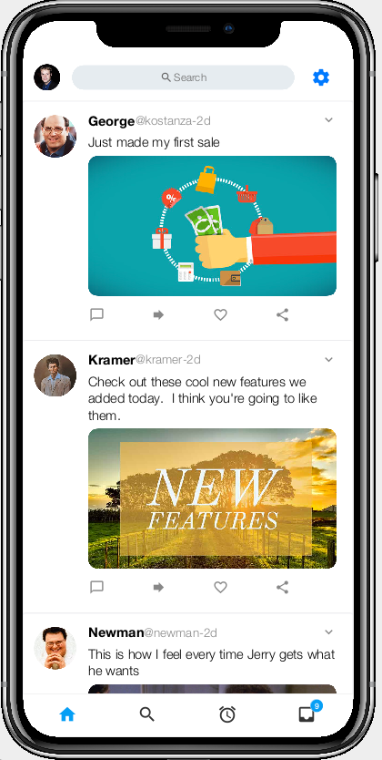
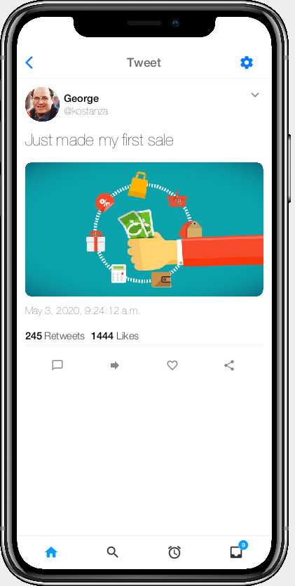
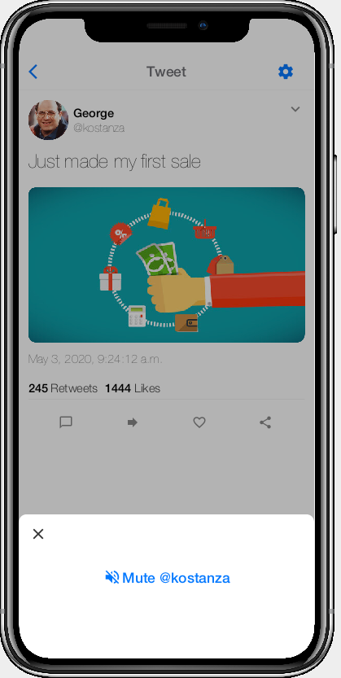
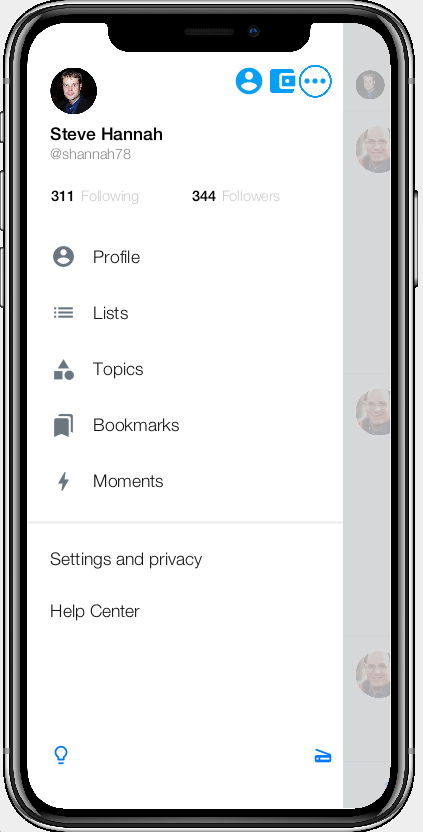
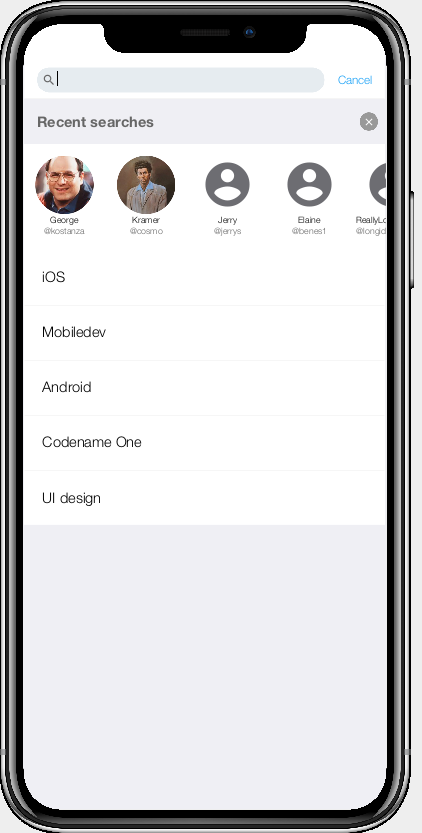
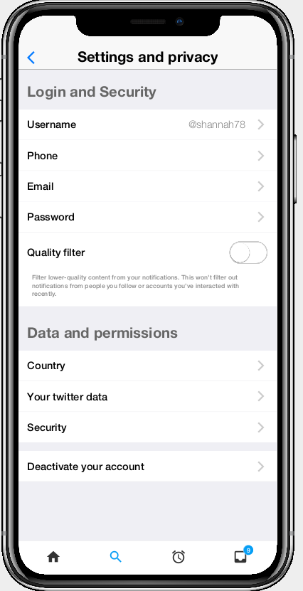

= Twitter UI Kit

Twitter-inspired UI components for Codename One

== Introduction

This kit includes growing collection of components that were inspired by the Twitter mobile app.  This library is built upon the solid foundation of CodeRAD, an MVC library which facilitates the development of rich, reusable components for Codename One.

This library contains both Views and Controllers.  You can pick and choose views individually to incorporate into your app.  Or you can go all in, and use the controllers in this library as the foundation of your app.

== A Birds-eye View

A few of the components available in the Twitter UI kit are shown below.

 

